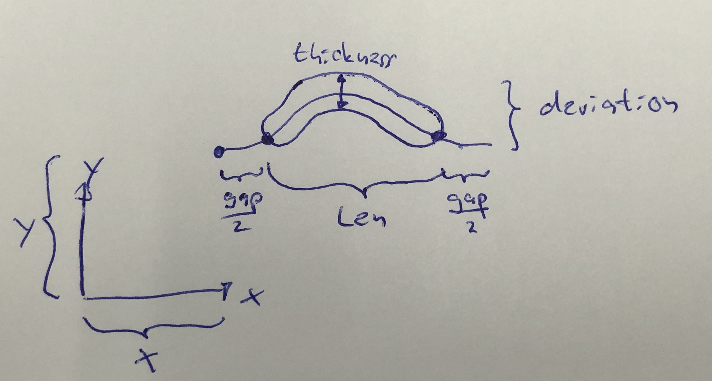
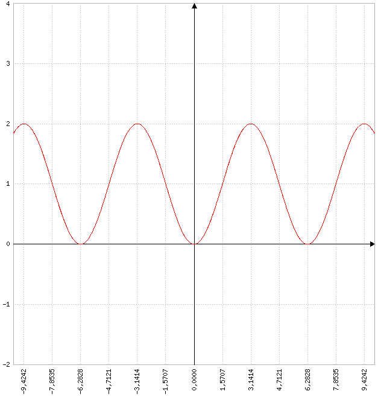
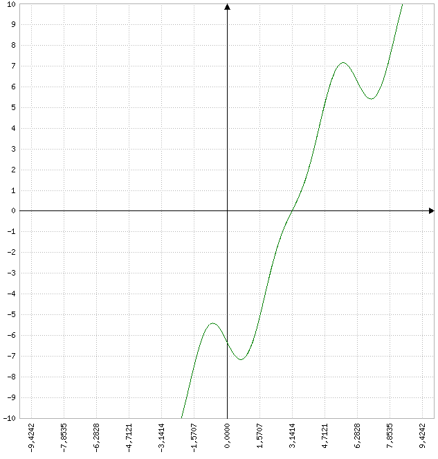
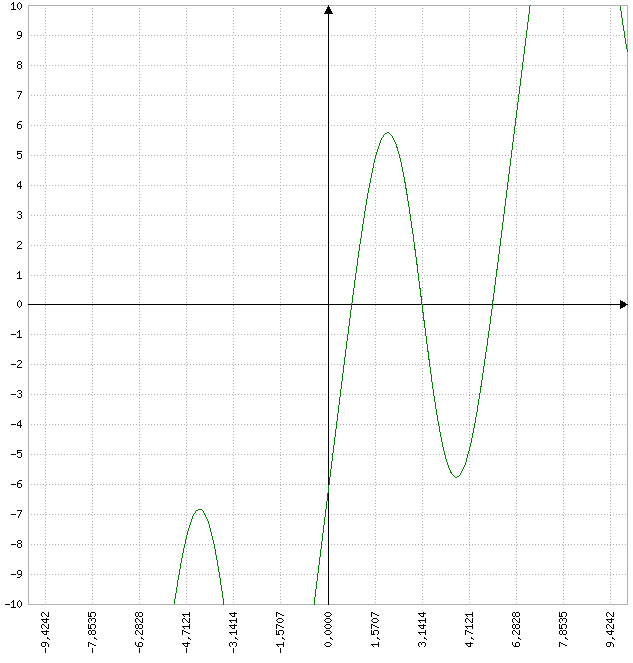
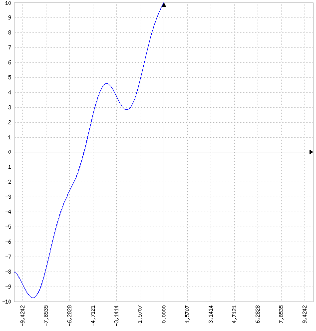

# Sinus wave geometry explanation

This file explains how to use the sinus wave hole and how it works.

## How to use

The sinus wave geometry describes a slit that is bent in the shape of a sinus wave. Imagine one period of a sinus wave where some distance was cut off from both ends. This curve is then thickened by a certain amount.  
**x** and **y** describe the starting point of the imaginary sinus wave. The entire length of the wave is **len** + **gap**. The height of the \"bump\" of the wave is **deviation**. The wave is shortened on both ends by **gap**/2 in x direction. And **thickness** describes the thickness of the resulting slit.

Additionally the orientation of the wave can be changed with the **dir** parameter. The letter (**x** or **y**) in the string note the coordinate the wave is lying in. Then a **+** or **-** define what direction the bump is facing in the other axis. So the direction of the wave in the image is **x+**.

## How it works

### Analytical analysis

The function of the wave in direction **x+** that is thickened is (The parameters **x** and **y** are represented with $x_0$ and $y_0$ respectively):
$$f(x) = y_0-\frac{\left(cos\left(\frac{(x-x_0)*2\pi}{len+gap}\right)\right)-1}{2}*deviation$$
$$\text{with } x\in\left[x_0+\frac{gap+thickness}{2}, x_0+len-\frac{gap+thickness}{2}\right]$$
To detect if a phonon is inside the structure the point on the line that is closest to the phonon is calculated. For this the distance between any point $(x,y)$ and the phonon point $(x_p, y_p)$ is expressed
$$d(x,y) = \sqrt{(x-x_p)^2+(y-y_p)^2}$$
By inserting $y=f(x)$ this turns into
$$d(x) = \sqrt{(x-x_p)^2+(f(x)-y_p)^2}$$
This expression needs to be minimized to find the closest point on the line to the phonon point. For this the expression is derived for x. Since the square root function is strictly monotone for values bigger than 0 minimizing the inner function is sufficient. To minimize the expression the function is derived and set equal to zero
$$d_i(x) = (x-x_p)^2+(f(x)-y_p)^2=(x-y_p)^2+\left(y_0-\frac{\left(cos\left(\frac{(x-x_0)*2\pi}{len+gap}\right)\right)-1}{2}*deviation-y_p\right)^2$$
$$d_i' = 2(x-x_p)+\frac{2\pi sin\left(\frac{2\pi(x-x_0)}{len+gap}\right)\left(y_0-\frac{\left(cos\left(\frac{(x-x_0)*2\pi}{len+gap}\right)\right)-1}{2*deviation}-y_p\right)}{len+gap}*deviation\overset{!}{=}0$$

### Geometrical analysis

This equation does not appear to have an analytical solution so lets look at some examples for this simplified version
$$f(x)=-cos(x)+1$$
$$d_i'(x)=-2(x_p-sin(x)(-y_p-cos(x)+1)-x)$$

(The vertical lines in the plots are in $\pi/2$ distances)

Remember that we are only interested in on \"bump\" so only $x\in(0,2\pi)$  
For a point on the line for example $(\pi,2)$ the derived function looks like this

The x position of the desired point can be easily calculated with a simple bisection method.  
Let's look at the line for the point $(\pi,-3)$

There function is equal to zero three times in the desired range. The points are one saddle point in the middle and two local minima on the sides. In this case the two local minima are the same but if the point is off-center one will be bigger.

Let's look at the point $(0,-5)$

Here the function is zero but outside the range we are interested in. We can use this fact to 